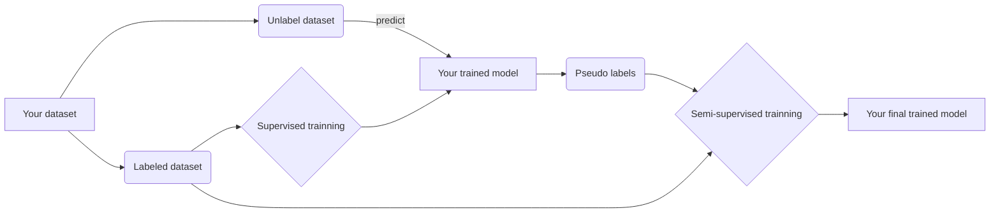

# Pseudo-label with Keras
This is an implementation of the semi-supervised aproach called pseudo-label using Keras.  This algorithm is based on article *"Pseudo-Label : The Simple and Efficient Semi-Supervised Learning Method for Deep Neural Networks"* by Dong-Hyun Lee.

**author:** Gabriel Kirsten Menenezes (https://github.com/gabrielkirsten/)
**version:** 0.0.1

## Pseudo-label algorithm

### Requirements:
__You must Install:__  
1. [Python 2.7](https://www.python.org/downloads/);
2. [Nvidia cuda libraries](https://developer.nvidia.com/cuda-downloads);
3. [Nvidia cuDCNN libraries](https://developer.nvidia.com/cudnn);
4. [Tensorflow](https://www.tensorflow.org/install/) or [Theano](http://deeplearning.net/software/theano/install.html)\*;
5. [Keras](https://keras.io/#installation);
6. [Sklearn](http://scikit-learn.org/stable/);
7. [h5py](http://www.h5py.org/).

**note**:  
\* never tested on Theano.

### How to use:

### TODO:
- [x] ~~Commit README [v0.0.1]~~ 
- [ ] Commit innital code 
- [ ] Implement supervised trainning
- [ ] Implement SDG with mini-batch on training
- [ ] Implement semi-supervised trainning
