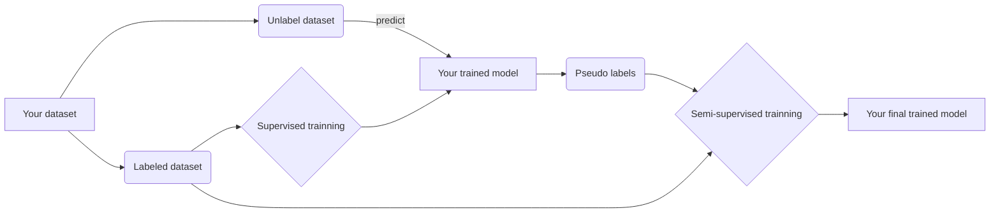

# Pseudo-label with Keras
This is an implementation of the semi-supervised aproach called pseudo-label using Keras.  This algorithm is based on article *"Pseudo-Label : The Simple and Efficient Semi-Supervised Learning Method for Deep Neural Networks"* by Dong-Hyun Lee.

**warning: This project is under development! To report a problem, create an Issue**

**author:** Gabriel Kirsten Menenezes (https://github.com/gabrielkirsten/)

## Pseudo-label algorithm



### Requirements:
__You must Install:__  
1. [Python 2.7](https://www.python.org/downloads/);
2. [Nvidia cuda libraries](https://developer.nvidia.com/cuda-downloads);
3. [Nvidia cuDCNN libraries](https://developer.nvidia.com/cudnn);
4. [Tensorflow](https://www.tensorflow.org/install/) or [Theano](http://deeplearning.net/software/theano/install.html)\*;
5. [Keras](https://keras.io/#installation);
6. [Sklearn](http://scikit-learn.org/stable/);
7. [h5py](http://www.h5py.org/).

**note**:  
\* never tested on Theano.


### How to use:
usage: ```main.py``` [-h] [-a ARCHITECTURE [ARCHITECTURE ...]] [-f FINETUNINGRATE] -d DATASETPATH [-n NOLABELPERCENT [NOLABELPERCENT ...]]

**optional arguments:**
```
  -h, --help            show this help message and exit
  -a ARCHITECTURE [ARCHITECTURE ...], --architecture ARCHITECTURE [ARCHITECTURE ...]
                        Select architecture(Xception, VGG16, VGG19, ResNet50,
                        InceptionV3, MobileNet)
  -f FINETUNINGRATE, --fineTuningRate FINETUNINGRATE
                        Fine tuning rate
  -d DATASETPATH, --datasetPath DATASETPATH
                        Dataset location
  -n NOLABELPERCENT [NOLABELPERCENT ...], --noLabelPercent NOLABELPERCENT [NOLABELPERCENT ...]
```

#### Parameters:
Some parameters are defined at the ```main.py``` as:
 - Image width (IMG_WIDTH), Image height (IMG_HEIGHT) and Image channels (IMG_CHANNELS);
 - Supervised batch size (BATCH_SIZE);
 - Pseudo-label batch size (PSEUDO_LABEL_BATCH_SIZE);
 - Epochs (EPOCHS);
 - Class names (CLASS_NAMES). 
 


